# Installation Guide

## Pre-Requisites

**Installation of the solution depends on the installation/configuration of the following Oracle 	Services**

- [Oracle Identity Cloud Service](https://docs.oracle.com/en/cloud/paas/identity-cloud/index.html)
- [Oracle REST Data Services (ORDS)](https://www.oracle.com/uk/database/technologies/appdev/rest.html)
- OCI Services
- [Oracle Functions](https://docs.oracle.com/en-us/iaas/Content/Functions/Concepts/functionsoverview.htm) 
- [Oracle API Gateway](ttps://docs.oracle.com/en-us/iaas/Content/APIGateway/Concepts/apigatewayoverview.htm) 

**Software Requirements**

- Oracle OCI Cloud
  - Access to Oracle Identity Cloud Service Administration Console
  - Access to OCI Console
    - With permission to deploy Cloud Functions, Vault and API Gateway
  - Newly provisioned ORDS instance, can be done directly into an Oracle Database or you can use an APEX service
  - Oracle VIsual Builder Cloud Service
- Desktop PC (Windows,Mac or Linux)
  - Oracle OCI CLI Client Installed and configured
    - See [here](https://docs.oracle.com/en-us/iaas/Content/API/SDKDocs/cliinstall.htm) for instructions on installing the OCI Client for your operating system
  - Oracle Cloud Functions "[Getting Started using the CLI](https://docs.oracle.com/en-us/iaas/developer-tutorials/tutorials/functions/func-setup-cli/01-summary.htm)" must have been completed so that you can deploy an sample Oracle Cloud Function to OCI Cloud
  - [Terraform](https://www.terraform.io/) 0.13.5, or later, Installed and working
- Oracle Fusion Applications R22 (or newer)
- Oracle Fusion Applications and Oracle Visual Builder Cloud service **must have their identities federated** with each other (i.e. Single Sign On between Oracle Fusion and Oracle Visual Builder works properly)

# Architecture Diagram

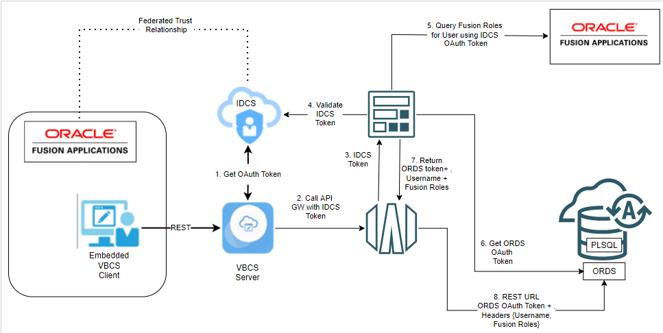

# Installation Steps

## Configuring Oracle Identity Cloud Service (IDCS) Confidential Application

1. Log into Oracle IDCS Console(https://idcs-<hostname>.identity.oraclecloud.com/ui/v1/adminconsole) and navigate to the application menu
   

   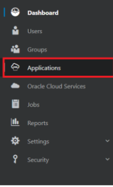

2.  Create a new Confidential Application with the following data

   1. Name : **VBCS_ORDS_IDENTITY_PROP**

   2. Client Configuration

      - Allowed Resource Grants : **Resource Owner, JWT Assertion**

      - Allowed Operations : **Introspect (checked)

        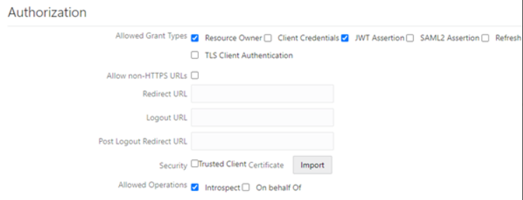

      - Click the

         

        "Add scopes"  button and add the Oracle Fusion Applications scope from the Oracle Fusion Applications (Fusion) IDCS application

        1. Click on Add Scope
        2. Then select the Oracle Applications Cloud (Fusion) application and click add
           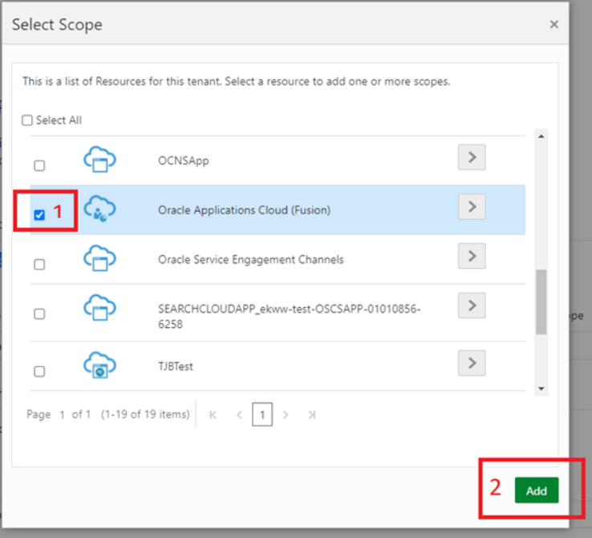
        3. Once added take note of the Fusion Applications Scope Name, this will be needed later (Fusion Apps OAuth Scope)
           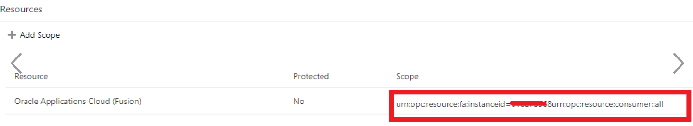

   3. Resources, Web , User and Groups can be skipped

   4. Ensure the application is **ACTIVATED
      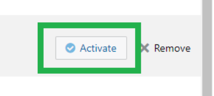

   5. Take note of the Application **Client ID** and **Client Secret** we will need this later and will refer to this as IDCS Client ID and IDCS Client Secret
      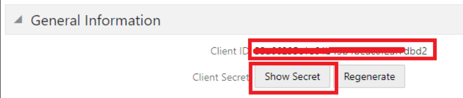

3. Using "Postman" you can test this all working  using the following steps :

   1. Create a new REST request (no need for the url itself)
   2. Set Authentication to OAuth 2.0
      1. Grant Type : Password **Credentials**
      2. Access Token URL : **https://<idcshostname>.[identity.oraclecloud.com/oauth2/v1/token](http://identity.oraclecloud.com/oauth2/v1/token)**
      3. Client ID : <Your IDCS Client ID from Earlier>
      4. Client Secret : < Your IDCS Client Secret from earlier>
      5. Username : <Your IDCS Username>
      6. Password :<Your IDCS Password>
      7. Scope : <Your Fusion Resource Scope> 
         e.g.
         urn:opc:resource:fa:instanceid=12345678urn:opc:resource:consumer::all
   3. Click Get Access Token and make sure you can successfully obtain an access token
      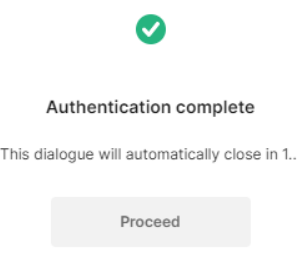


## Configure ORDS PL/SQL REST API 

These instructions are for configuring ORDS, using the version of ORDS within APEX Service, the steps are similar for standalone ORDS

1. Navigate to SQL Workshop / Restful Services in the APEX UI

   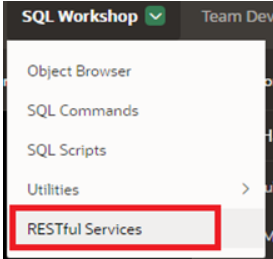

2. Create a new ORDS Module called VBCS_ORDS_IDPROP with the path VBCS_ORDS_IDPROP

3. Within this Module create a template called "test"
   

   

4. Within the template create a handler called "test_identity". This is the PLSQL REST Reqest we are going to call from VIsual Builder

   1. Method is GET

   2. Type is PLSQL

   3. Source Type : PLSQL

   4. Source code is as below. This sample code simply returns the username and roles passed to the PLSQL procedure

      ```plsql
      begin
         open_object;
         write('x-auth-username',:p_x_auth_username);
         write('x-auth-fusion-roles',:p_x_auth_fusion_roles);
         close_object;
      end;
      ```

      

5. Add Parameters 

   - All data types are STRING and as HEADERS

   - Name is **x-auth-username** and **x-auth-fusion-roles** (Note MINUS SIGNS not underscores)

   - Bind variables are **p_x_auth_username** and **p_x_auth_fusion_roles** (UNDERSCORES)

     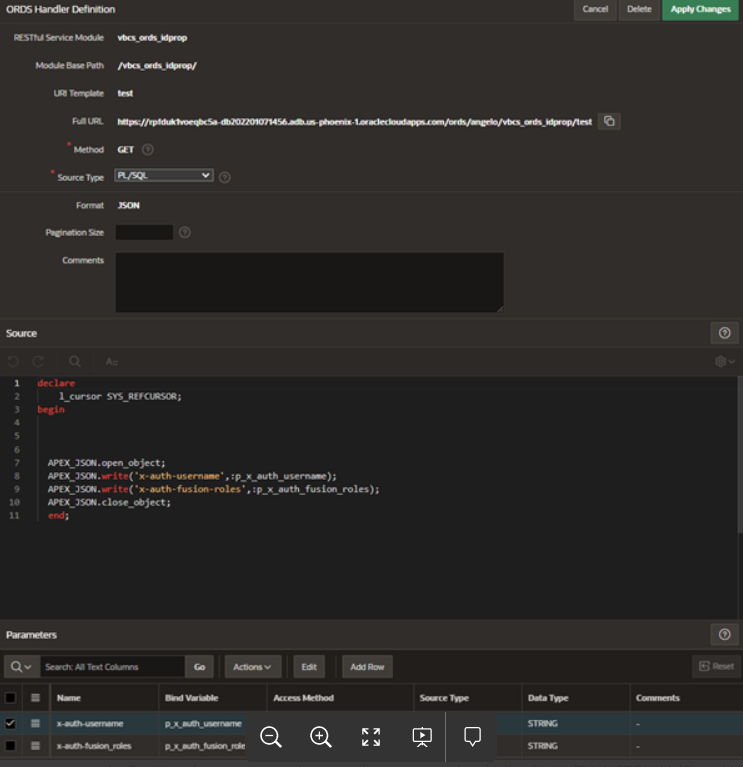

     

6. Currently the PL/SQL API is un-authenticated but just like before with IDCS we can now test this using postman. We will be setting authentication in the next step.

   1. Set Authentication to **"No Authentication"**
   2. Set Headers to some dummy data appropriately (i.e. X-AUTH-USERNAME and X-AUTH-FUSION-ROLES)
   3. When you execute this you should receive the username and roles as part of the response. 
      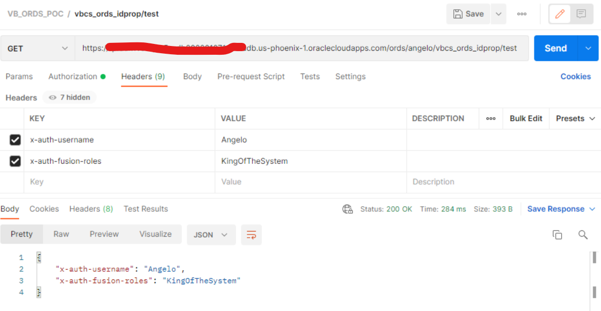

7. We now need to secure the REST API by using OAuth 2.0. ORDS only supports Client Credentials so we'll configure this, an alternative is to use Basic authentication from our middle tier but we decided to make this modern.

8. Within the APEX SQL Workshop screen execute the following PLSQL
   ```plsql
   BEGIN
     ORDS.CREATE_ROLE(p_role_name=>'vbcs_ords_idproprole');
     OAUTH.CREATE_CLIENT(
     p_name            => 'vbcs_ords_id_client',
     p_grant_type      => 'client_credentials',
     p_owner           => 'Name',
     p_description     => 'vbcs_ords_idproprole oauth client user',
     p_support_email   => 'email@domain.com',
     p_privilege_names => '');
     OAUTH.GRANT_CLIENT_ROLE(
          p_client_name => 'vbcs_ords_id_client',
          p_role_name   => 'vbcs_ords_idproprole'
     );
     COMMIT;
   END;
   ```

   

   This creates an OAuth Application within ORDS (APEX) 

   

9. We can query the ClientID and Client Secret with the following SQL
   ```
   select id, name, client_id, client_secret from user_ords_clients where name ='vbcs_ords_id_client'
   
   ```

   Resulting in this 
   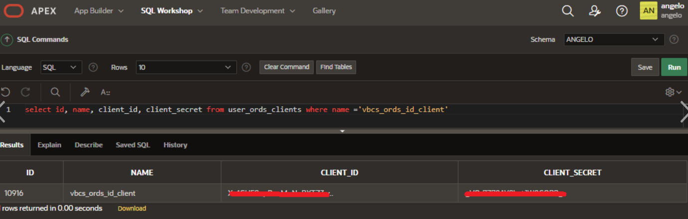

   Take note of the **Client_ID** and **Client_Secret**, this will be referred to as the BACKEND_CLIENT_ID AND BACKEND_CLIENT_SECRET later on in this document

10. Within the ORDS Restful Services UI Navigate to the privileges section and add a privilege called "**vbcs_ords_idprov_priv**"

    1. Add the roles **VBCS_ORDS_IDPROPROLE** and OAuth2 Client Developer

    2. Add the module **VBCS_ORDS_IDPRO** to the protected modules section

       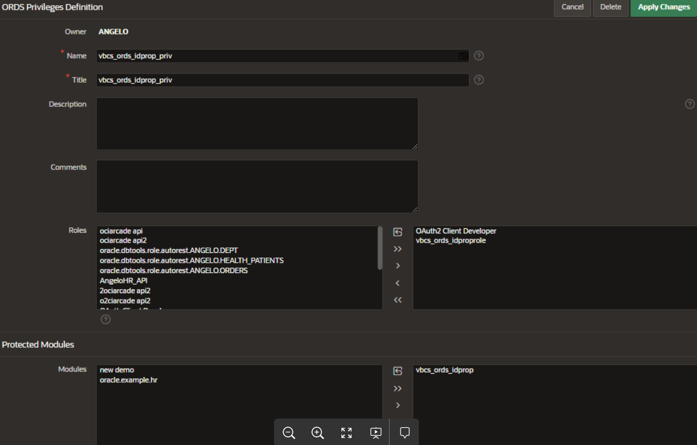

       This now protects the resource with our OAuth Client Credentials

       
11. You can test this now in "Postman"

    1. Set the URL to the full url of the REST Service

    2. Set grant type to **Client Credentials**

    3. Set the access token URL to https://<your APEX service>/ords/<Username>/oauth/token

    4. Set Client ID and Client Secret to the Backend Client ID & Client Secret we obtained earlier

    5. Get New access token, Use it then execute the query

       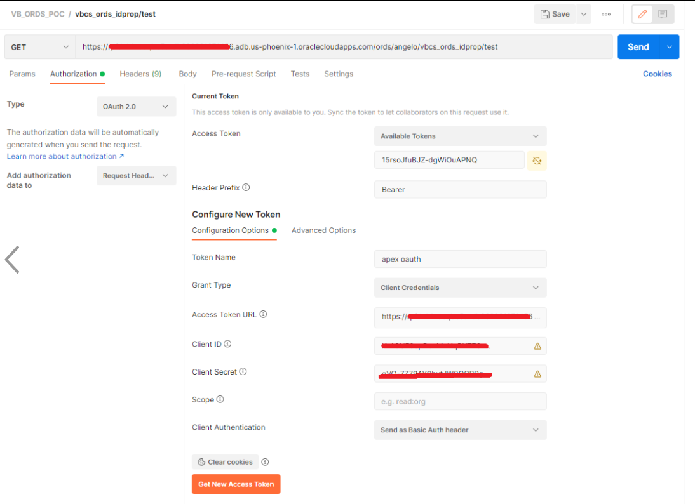


       The ORDS Service is now set up

## Setting up Oracle OCI Policies

| Policy Type                        | Policy                                                       | Usage                                                        |
| :--------------------------------- | :----------------------------------------------------------- | :----------------------------------------------------------- |
| Dynamic Group called "FN_DYN_GRP"  | ALL {resource.type='fnfunc', [resource.compartment.id](http://resource.compartment.id/)='<**YOUR_COMPARTMENT_OCID**>'} | Dynamically defines all Function instances within the given compartment |
| Policy                             | Allow dynamic-group **FN_DYN_GRP** to use vaults in compartment <**YOUR_COMPARTMENT_NAME**> | Allow access the KMS Vaults                                  |
| Policy                             | Allow dynamic-group **FN_DYN_GRP** to use keys in compartment <**YOUR_COMPARTMENT_NAME**> | Allow access the keys in KMS                                 |
| Policy                             | Allow dynamic-group **FN_DYN_GRP** to use secret-family in compartment <**YOUR_COMPARTMENT_NAME**> | Allow access the secrets in KMS                              |
| Dynamic Group called "API_DYN_GRP" | ALL {resource.type='ApiGateway', [resource.compartment.id](http://resource.compartment.id/)='<**YOUR_COMPARTMENT_OCID**>'} | Dynamically defines all Function instances within the given compartment |
| Policy                             | Allow dynamic-group **API_DYN_GRP** to use functions-family in compartment <**YOUR_COMPARTMENT_NAME**> | Allow access the invoke Functions.                           |

## Deploy OCI Cloud Native Components Using Terraform

1. Download the repository to your local computer

2. Copy **auto.tfvars.template** to **config.auto.tfvars**

3. Edit

   auto.tfvars.template 

   file and set the ORDS URL to your APEX (ORDS) Service

   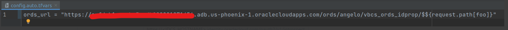

   1.  **NOTE : Do not remove the $${request.path[foo] suffix, this gets replaced with whatever you pass into API Gateway**

4. Copy **appconfig.tmpl.template** to **appconfig.tmpl**

5. Edit this file and set the following parameters

   | back_end_token_endpoint     | This is your ORDS OAuth token url . The format is http://<ORDS DATABASE HOSTNAME>/ords/<USERNAME>/oauth/token |
   | --------------------------- | ------------------------------------------------------------ |
   | back_end_app_client_id      | The ORDS Client ID generated earlier on in this document     |
   | idcs_app_client_id          | The IDCS Client ID generated earlier on in this document     |
   | idcs_introspection_endpoint | IDCS Introspection endpoint URL,  the URL will be https://<IDCS_HOSTNAME>.[identity.oraclecloud.com/oauth2/v1/introspect](http://identity.oraclecloud.com/oauth2/v1/introspect) |
   | Fusion_Hostname             | Hostname for Oracle Fusion (**Without the https**)           |

6. Now run terraform to deploy the components using 

   ```	shell
   terraform plan
   terraform apply auto-approve
   ```

   Monitor the output for any errors

7. Once this has been deployed successfully we now need to set the Client Secrets (IDCS & BACKEND) in OCI Vault

8. Within OCI Console Navigate to the OCI Vault created by the terraform script

   1. Within the fault there will be two secrets created, these secrets currently contain dummy random data

   2. Replace each secret with the real client secret, ie **idcs_app_client_secret** contains the **idcs_Client_Secret** and the same for the backend secret

      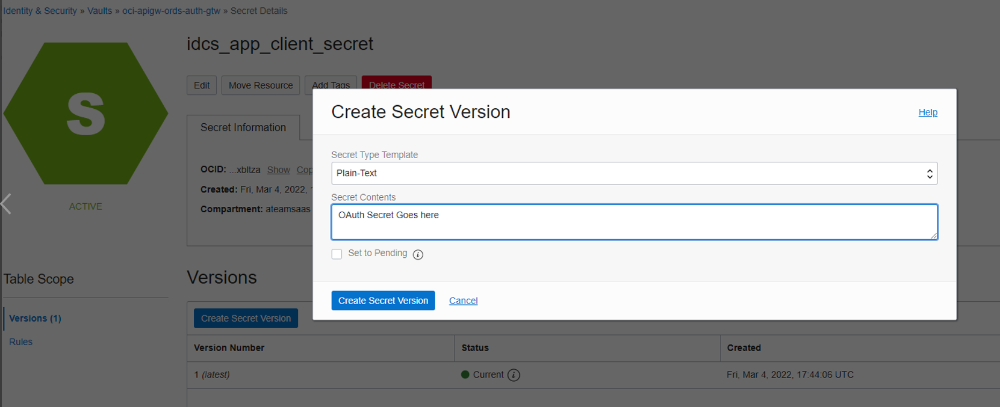

9. All modules now deployed. Note, the current deployment is assuming that he ORDS module is **vbcs_ords_idprop** and the path is set accordingly in API Gateway by Terraform 

10. Test in Postman 

    1. Set the URL to the API Gateway endpoint + test URL

       1. You can find the API Gateway deployment endpoint by looking at the OCI Gateway configuration in Oracle OCI Console
          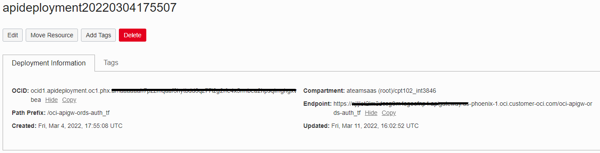

    2. Set grant type to Client Credentials

    3. Set the access token URL to https://<your APEX service>/ords/<Username>/oauth/token

    4. Set Client ID and Client Secret to the Backend Client ID & Client Secret we obtained earlier

    5. Get New access token, Use it then execute the query

       

    6. You should receive a response with a JSON payload showing the Username and the Fusion Roles from Oracle

## Testing Using Oracle VBCS

1. Log into Oracle VBCS and create an Application

2. Navigate to the connections tab

3. Create a new connection

   1. Set URL to the gateway URL

   2. Set Authentication to User Assertion (this ensures VBCS puts the username into the token) and select "Select One" as the test URL only receives a single record

   3. Set Client ID and Client Secret

      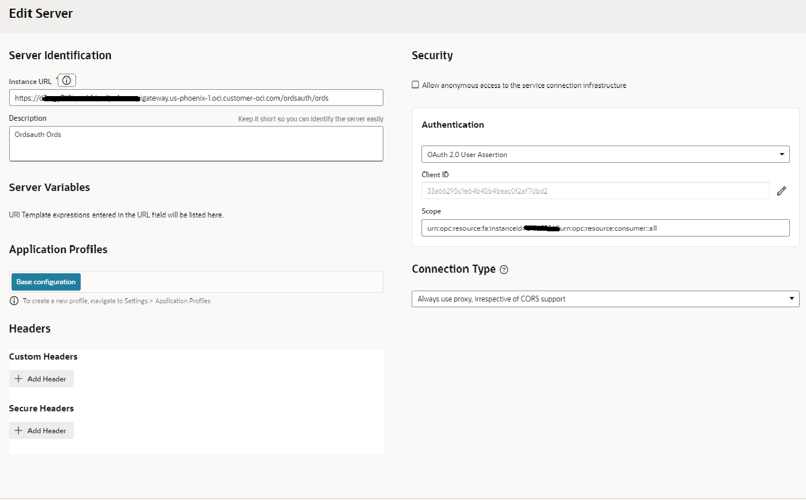

4. Navigate to test and test the URL and see the results

##  Limitations

- The solution passes the Oracle Fusion Roles as a header parameter which is further limited by the Database Varchar2 datatype. Varchar2 datatype is limited to 4000 characters, or 32767 characters, (assuming single byte character set) depending on the configuration of your database.  

  For 32k support your database must have the MAX_STRINGS_SIZE parameter set in your database configuration. See http
  s://docs.oracle.com/en/database/oracle/oracle-database/21/refrn/MAX_STRING_SIZE.html for more details 

- API Gateway caches headers until either IDCS or ORDS token expires. If you call API Gateway from VBCS and then change the user roles in Oracle Fusion you may not see these role changes until you either log out or wait until the token expires.