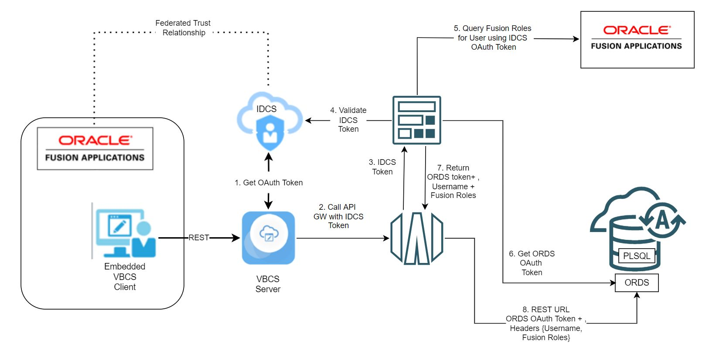

# Oracle Fusion SaaS VBCS & ORDS Identity Propagation Sample using Oracle OCI Cloud Native Services

A common pattern we see in Oracle Fusion SaaS solutions is to "offload" data from Fusion SaaS to a Autonomous Database (ATP) for multiple reasons. Sometimes the data is not accessible via REST APIs, sometimes we need to preprocess the data before displaying and sometimes its for performance reasons (i.e. using the DB like a cache).

The issue with moving the data from Fusion SaaS to a ATP database is  that you loose all data security in SaaS. Sometimes this is not an issue but often it is. A common pattern is to build a API layer in a middle tier (like Helidon) which queries the data from the Database. The middle-tier  can be secured using OAuth authentication from IDCS (Identity Cloud Service) which in turn is federated to Oracle SaaS and given IDCS and Fusion Applications are federated the token will contain the username of the call (but not the Fusion Roles).

This is all good, but Oracle ATP, and Oracle APEX Service, support a technonology called "ORDS" (Oracle REST Data Services) which allows you to expose PLSQL, and SQL queries, as REST endpoints. The only issue here is, unlike Helidon, Oracle ORDS within Oracle ATP does not support federation to Oracle IDCS. Additionally within PLSQL, or SQL , block, the user is always the same (the user who exposed the REST APIs) so implementing data security is very difficult.

## The Solution

This solution uses Oracle OCI Cloud Native components (Oracle API Gateway and Oracle Cloud Functions) and provides a serverless middletier which intercepts the calls to Oracle ATP and then injects the username (and Fusion Roles) as headers to the PLSQL/SQL function in ORDS.

For more information on how the solution works please see the blog entry on A-Team chronicles ([link](https://www.ateam-oracle.com/post/identity-propagation-to-ords-for-a-vbcs-fusion-saas-extension)

### Services used in this example

* [Oracle Cloud Functions](https://docs.oracle.com/en-us/iaas/Content/Functions/Concepts/functionsoverview.htm)
* [Oracle API Gateway](https://docs.oracle.com/en-us/iaas/Content/APIGateway/Concepts/apigatewayoverview.htm)
* [Oracle Identity Cloud Service](https://docs.oracle.com/en/cloud/paas/identity-cloud/index.html) 
* [Oracle Fusion SaaS Applications](https://www.oracle.com/uk/applications/) Release 22A or later
* [Oracle Rest Data Services](https://www.oracle.com/uk/database/technologies/appdev/rest.html)  (pre-deployed with [Oracle ATP/ADW](https://www.oracle.com/uk/autonomous-database/) , [APEX Service](https://apex.oracle.com/en/platform/apex-service/)) or can be deployed directly onto Oracle Cloud Database

### About Oracle Cloud Functions (Fn)
[Oracle Functions](https://docs.oracle.com/en-us/iaas/Content/Functions/home.htm#top) is a fully managed, multi-tenant, highly scalable, on-demand, Functions-as-a-Service platform. It is built on enterprise-grade Oracle Cloud Infrastructure and powered by the Fn Project open source engine. Use Oracle Functions (sometimes abbreviated to just Functions) when you want to focus on writing code to meet business needs.

### About Terraform
[Terraform](https://www.terraform.io/) is a very powerful tool for implementing infrastructure using code. As such, it represents a strong mechanism for managing complex 
cloud related deployments. It handles all the details of dependency ordering and tries to use parallelism where possible to provision.

### About Oracle API Gateway

The Oracle API Gateway service enables you to publish APIs with private endpoints that are accessible from within your network, and which you can expose with public IP addresses if you want them to accept internet traffic. The endpoints support API validation, request and response transformation, CORS, authentication and authorization, and request limiting.

### About Oracle Identity Cloud Service

[Oracle Identity Cloud Service](https://docs.oracle.com/en/cloud/paas/identity-cloud/index.html) provides an innovative, fully integrated service that delivers all the core identity and access management capabilities through a multi-tenant Cloud platform

### About Oracle REST Data Services

[Oracle REST Data Services (ORDS)](https://www.oracle.com/uk/database/technologies/appdev/rest.html) bridges HTTPS and your Oracle Database. A mid-tier Java application, ORDS provides a Database Management REST API, SQL Developer Web, a PL/SQL Gateway, SODA for REST, and the ability to publish RESTful Web Services for interacting with the data and stored procedures in your Oracle Database

## Installation

Installation instructions can be found here on [Installation.md](INSTALLATION.md) 

For more information Please see the A-Team Chronicles blog post

## Contributing

This sample code is an open source project. Before submitting a pull request, please [review our contribution guide](./CONTRIBUTING.md). Oracle gratefully acknowledges the contributions to it that have been made by the community.

## Security

For more information on security please see [SECURITY.md](SECURITY.md)

## License

Copyright (c) 2022 Oracle and/or its affiliates.

Released under the Universal Permissive License v1.0 as shown at
<https://oss.oracle.com/licenses/upl/>.

## Distribution

Developers choosing to distribute a binary implementation of this project are responsible for obtaining and providing all required licenses and copyright notices for the third-party code used in order to ensure compliance with their respective open source licenses.

## Help

If you need help with this sample please log an issue and we'll try and help

Copyright (c) 2022, Oracle and/or its affiliates. All rights reserved. Licensed under the Universal Permissive License v 1.0 as shown at https://oss.oracle.com/licenses/upl.
